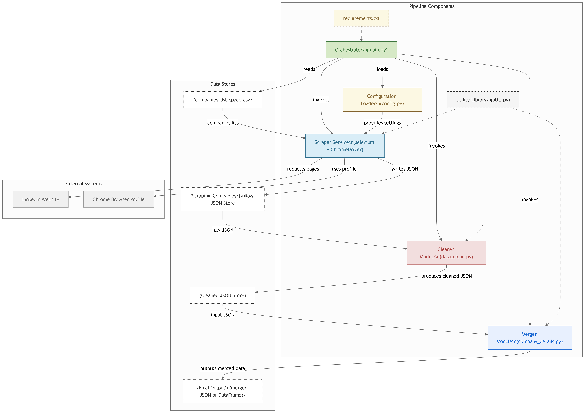

# Linkedin Scrapper

I developed a LinkedIn scraper using **Selenium** and  **Chrome** to extract company data, including the home page, about page, and job listings without signing in using my already signed in browser. It cleans and merges data using **pandas** and **json** for accurate results. Custom modules ensure dynamic content handling and remove empty fields efficiently.

# Architecture Diagram



# How to clone 
Clone this repository:

```git clone https://github.com/your-repo/linkedin-scraper.git ```

```cd linkedin-scraper```

# How to Use this code
- Configuration Folder -> Config.py

    ```
    chrome_profile_path = r"C:\Users\Micro Tech\AppData\Local\Google\Chrome\User Data\Profile 1" 
    ```

Go to ```C:\Users\username\AppData\Local\Google\Chrome\User Data```

Copy your google profile path and change it here

# Requirements
Make a seperate Enviroment install requirements.txt using 
``` pip install requirements.txt ```


# How to Run
Close all your browser and then press run button it will start scrapping data for you.

```AND ALL SET :)```

